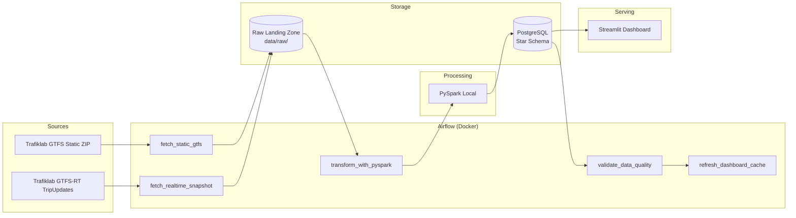
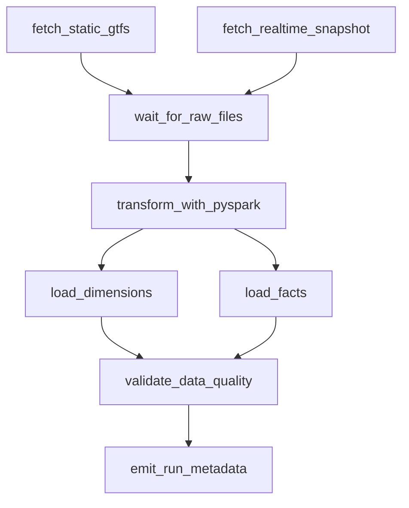

# Swedish Public Transport Delay Pipeline — 4-Week Project Plan

**Goal:** Build an Airflow-orchestrated, PySpark-powered ETL pipeline on Swedish public transit (GTFS) data, landing in a Kimball-style star schema in PostgreSQL, visualized in a Streamlit dashboard, fully containerized and CI/CD-tested — a direct answer to the Airflow / PySpark / dimensional-modeling gaps in your current profile.

**Total cost: $0.** Everything runs locally in Docker. No cloud spend required.

---

## Table of Contents

1. [Executive Summary](#executive-summary)
2. [Success Criteria & Definition of Done](#success-criteria--definition-of-done)
3. [Skills Gap Mapping](#skills-gap-mapping)
4. [Tech Stack](#tech-stack)
5. [System Architecture](#system-architecture)
6. [Repository Structure](#repository-structure)
7. [Data Sources & Contracts](#data-sources--contracts)
8. [Star Schema Specification](#star-schema-specification)
9. [Pipeline DAG Specification](#pipeline-dag-specification)
10. [Week 1 — Foundation](#week-1--foundation-data-access--airflow-setup)
11. [Week 2 — Transformation](#week-2--transformation-pyspark--star-schema)
12. [Week 3 — Serving Layer](#week-3--serving-layer-dashboard--data-quality--tests)
13. [Week 4 — Productionization](#week-4--productionization-cicd-docs-polish)
14. [Testing Strategy](#testing-strategy)
15. [Data Quality Framework](#data-quality-framework)
16. [CI/CD Pipeline Specification](#cicd-pipeline-specification)
17. [Documentation Deliverables](#documentation-deliverables)
18. [Optional Extra Features](#optional-extra-features-ranked-by-resume-impact)
19. [Post-4-Week Roadmap](#post-4-week-roadmap)
20. [Risk Register](#risk-register)
21. [Interview Talking Points](#interview-talking-points-by-week)
22. [Resume & Portfolio](#resume--portfolio)

---

## Executive Summary

### Problem Statement

Public transit operators publish schedule data (GTFS static) and live vehicle positions / arrival updates (GTFS-RT). These feeds are rarely joined, modeled, and analyzed in a production-grade pipeline. This project demonstrates that you can:

- Ingest heterogeneous transit data on a schedule with fault tolerance
- Transform messy, real-world GTFS quirks (timezones, post-midnight times, protobuf) into a clean analytical model
- Serve business-ready metrics through a dashboard backed by tested, documented infrastructure

### Scope

| In scope | Out of scope (for v1) |
|---|---|
| One primary operator (SL Stockholm or Östgötatrafiken) | Full national Sweden coverage |
| Daily static GTFS + 15-min realtime snapshots | Sub-second streaming / Kafka |
| Kimball star schema in PostgreSQL | Data lake / Delta Lake |
| Local Docker deployment | Paid cloud hosting |
| Streamlit analytics dashboard | Mobile app |
| pytest + GitHub Actions CI | Full observability stack (Grafana/Prometheus) |

### Primary Users (for portfolio narrative)

- **Data analyst persona:** wants delay trends by route, stop, and time of day
- **Operator persona (hypothetical):** wants to identify chronic late stops for service planning
- **You (job seeker):** needs a concrete artifact proving orchestration, Spark, modeling, and CI/CD skills

---

## Success Criteria & Definition of Done

### Project-level "done" checklist

- [ ] Airflow DAG runs end-to-end on schedule without manual intervention
- [ ] Raw → transformed → loaded path is reproducible from a fresh `git clone` + `docker-compose up`
- [ ] Star schema populated with at least 7 days of delay facts (real or honestly labeled simulated)
- [ ] Streamlit dashboard renders 4+ views from live Postgres data
- [ ] ≥12 pytest tests passing in CI
- [ ] README includes architecture diagram, setup steps, design decisions, and demo video link
- [ ] Zero undocumented secrets; `.env.example` provided

### Weekly phase gates

| Week | Phase gate — you do not proceed until… |
|---|---|
| 1 | Two Airflow tasks land raw static + realtime files on schedule; folder structure is deterministic |
| 2 | `fact_trip_delay` has rows in Postgres; dimensions are populated; one manual DAG run succeeds |
| 3 | Dashboard connects to Postgres; data quality task fails intentionally on bad data; tests green locally |
| 4 | CI passes on `main`; demo video recorded; portfolio page updated |

---

## Skills Gap Mapping

| Gap (from profile review) | How this project closes it | Evidence artifact |
|---|---|---|
| Apache Airflow | DAG with scheduling, retries, task chaining, optional SLA | `dags/dag_ingest_gtfs.py`, Airflow UI screenshot |
| PySpark | Local-mode transform job reading GTFS, writing JDBC | `jobs/transform_gtfs.py`, Spark logs |
| Dimensional modeling | Kimball star schema with documented grain | `sql/schema.sql`, ER diagram |
| CI/CD | GitHub Actions on push | `.github/workflows/ci.yml` |
| Containerization | docker-compose multi-service stack | `docker-compose.yml` |
| Terraform (optional) | IaC for local infra | `terraform/` (stretch) |
| Kubernetes (optional) | kind/minikube deployment | `k8s/` manifests (stretch) |

---

## Tech Stack

| Layer | Tool | Version guidance (pin in README) |
|---|---|---|
| Data source | Trafiklab GTFS static + GTFS-RT feeds | API v1/v2 per operator docs |
| Orchestration | Apache Airflow (docker-compose, local) | Airflow 2.8+ |
| Processing | PySpark (local mode) | Spark 3.5+, Python 3.11 |
| Storage | PostgreSQL (star schema) | Postgres 15+ |
| Dashboard | Streamlit | Latest stable |
| CI/CD | GitHub Actions | `ubuntu-latest` runner |
| Testing | pytest, pytest-cov | — |
| Linting | ruff | — |
| Containerization | Docker + docker-compose | Docker Compose v2 |
| Static GTFS parsing | `gtfs-kit` | — |
| Realtime parsing | `gtfs-realtime-bindings` | protobuf |
| DB access (dashboard) | SQLAlchemy + psycopg2 | — |
| Maps (dashboard) | pydeck or folium | optional |

### Python dependencies (starter `requirements.txt` outline)

```
apache-airflow-providers-apache-spark  # if using SparkSubmitOperator
pyspark
gtfs-kit
gtfs-realtime-bindings
psycopg2-binary
sqlalchemy
streamlit
pydeck
pytest
pytest-cov
ruff
requests
python-dotenv
```

---

## System Architecture

### High-level data flow



### Component responsibilities

| Component | Responsibility | Failure mode |
|---|---|---|
| Airflow Scheduler | Triggers DAG runs on cron | Retries + alert callback |
| Airflow Workers | Execute Python/Bash/Spark tasks | Task-level retry, DAG run marked failed |
| Raw landing zone | Immutable daily snapshots | Partitioned by date; never overwrite same partition |
| PySpark job | Parse, join, compute delays, build dims/facts | Exit non-zero → downstream tasks skip |
| PostgreSQL | Analytical store | Init script creates schema; migrations in `sql/` |
| Streamlit | Read-only analytics | Graceful empty-state if no data |
| GitHub Actions | Quality gate on merge | Block merge if tests/lint fail |

### Network / ports (local)

| Service | Port | Notes |
|---|---|---|
| Airflow Webserver | 8080 | Default login `airflow` / `airflow` — change in prod |
| PostgreSQL (analytics) | 5432 | Separate from Airflow metadata DB |
| Streamlit | 8501 | Exposed in docker-compose or run host-side |

---

## Repository Structure

```
transit-delay-pipeline/
├── .github/
│   └── workflows/
│       └── ci.yml
├── dags/
│   ├── dag_ingest_gtfs.py          # Main pipeline DAG
│   └── dag_data_quality_only.py    # Optional: re-run validations
├── jobs/
│   ├── ingest/
│   │   ├── fetch_static_gtfs.py
│   │   └── fetch_realtime_snapshot.py
│   ├── transform_gtfs.py           # PySpark entrypoint
│   └── validate_data_quality.py
├── sql/
│   ├── schema.sql                  # DDL: dims + facts
│   ├── seed_dim_date.sql           # Pre-populate date dimension
│   └── indexes.sql
├── dashboard/
│   ├── app.py                      # Streamlit entry
│   ├── queries.py                  # Parameterized SQL
│   └── components/                 # Chart helpers
├── tests/
│   ├── unit/
│   │   ├── test_delay_calculation.py
│   │   ├── test_gtfs_time_parsing.py
│   │   └── test_schema_contracts.py
│   ├── integration/
│   │   ├── test_postgres_load.py
│   │   └── test_transform_smoke.py
│   └── conftest.py                 # Fixtures: test DB, sample GTFS
├── data/                           # Gitignored except .gitkeep
│   └── raw/
│       ├── static/{YYYY-MM-DD}/
│       └── realtime/{YYYY-MM-DD}/{HH-mm-ss}/
├── docker/
│   ├── airflow/
│   │   └── Dockerfile              # Custom image with deps
│   └── postgres/
│       └── init/                   # Mount schema.sql here
├── docs/
│   ├── architecture.md
│   ├── star_schema.md
│   ├── decisions/                  # ADRs (Architecture Decision Records)
│   │   ├── 001-operator-choice.md
│   │   ├── 002-grain-of-fact-table.md
│   │   └── 003-simulated-vs-real-realtime.md
│   └── demo/                       # Screenshots for README
├── scripts/
│   ├── bootstrap.sh                # One-command local setup
│   └── download_sample_gtfs.py     # Offline dev without API key
├── .env.example
├── .gitignore
├── docker-compose.yml
├── pyproject.toml                  # ruff + pytest config
├── requirements.txt
└── README.md
```

---

## Data Sources & Contracts

### Trafiklab access

1. Register at [trafiklab.se](https://www.trafiklab.se/) → API key (free tier).
2. Subscribe to:
   - **GTFS Sweden Static** (or regional static feed for SL / Östgötatrafiken)
   - **GTFS-RT TripUpdates** for the same operator
3. Store API key in `.env` → `TRAFIKLAB_API_KEY`; never commit.

### Static GTFS files used

| File | Key fields | Notes |
|---|---|---|
| `stops.txt` | `stop_id`, `stop_name`, `stop_lat`, `stop_lon` | Join key for realtime |
| `routes.txt` | `route_id`, `route_short_name`, `route_long_name`, `route_type` | Maps to `dim_route`, `dim_vehicle_type` |
| `trips.txt` | `trip_id`, `route_id`, `service_id` | Bridge routes ↔ stop_times |
| `stop_times.txt` | `trip_id`, `stop_id`, `arrival_time`, `departure_time`, `stop_sequence` | Scheduled times; parse >24:00 |
| `calendar.txt` / `calendar_dates.txt` | service active days | Filter trips by run date |

### GTFS-RT TripUpdates contract

- Format: Protocol Buffers (`FeedMessage`)
- Relevant fields: `trip.trip_id`, `stop_id`, `arrival.delay` (seconds) or `arrival.time` (Unix)
- **Join logic:** `trip_id` + `stop_id` (+ optional `stop_sequence`) → match `stop_times`
- **Fallback:** If realtime coverage is sparse, document coverage % in README and optionally simulate delays (clearly labeled)

### Raw landing zone contract

```
data/raw/static/{YYYY-MM-DD}/gtfs.zip          # Immutable once written
data/raw/realtime/{YYYY-MM-DD}/{HH-mm-ss}/tripupdates.pb
data/raw/realtime/{YYYY-MM-DD}/{HH-mm-ss}/metadata.json   # pull timestamp, operator, record count
```

Each `metadata.json` should include:

```json
{
  "operator": "SL",
  "feed_type": "trip_updates",
  "pulled_at_utc": "2026-07-11T11:30:00Z",
  "record_count": 1842,
  "api_status": 200
}
```

---

## Star Schema Specification

### Design principles

- **Grain:** one row in `fact_trip_delay` = one `(trip_id, stop_id, service_date)` observation
- **Conformed dimensions:** `dim_date` reusable across any future fact tables
- **SCD Type 1** for stop/route name changes (overwrite) — document this choice in `docs/decisions/`
- **Surrogate keys** on all dimensions; natural keys (`route_id`, `stop_id`) kept for traceability

### Entity-relationship diagram

```mermaid
erDiagram
    dim_date ||--o{ fact_trip_delay : "service_date_key"
    dim_route ||--o{ fact_trip_delay : "route_key"
    dim_stop ||--o{ fact_trip_delay : "stop_key"
    dim_vehicle_type ||--o{ fact_trip_delay : "vehicle_type_key"

    dim_date {
        int date_key PK
        date full_date
        int day_of_week
        string day_name
        boolean is_weekend
        boolean is_swedish_holiday
    }

    dim_route {
        int route_key PK
        string route_id NK
        string route_short_name
        string route_long_name
        string operator
    }

    dim_stop {
        int stop_key PK
        string stop_id NK
        string stop_name
        float stop_lat
        float stop_lon
    }

    dim_vehicle_type {
        int vehicle_type_key PK
        int gtfs_route_type
        string type_name
    }

    fact_trip_delay {
        int delay_key PK
        int date_key FK
        int route_key FK
        int stop_key FK
        int vehicle_type_key FK
        string trip_id
        int stop_sequence
        timestamp scheduled_arrival
        timestamp actual_arrival
        int delay_seconds
        string data_source
    }
```

### DDL sketch (`sql/schema.sql`)

```sql
CREATE TABLE dim_date (
    date_key            INTEGER PRIMARY KEY,  -- YYYYMMDD
    full_date           DATE NOT NULL UNIQUE,
    day_of_week         SMALLINT NOT NULL,    -- 1=Mon .. 7=Sun (ISO)
    day_name            VARCHAR(10) NOT NULL,
    is_weekend          BOOLEAN NOT NULL,
    is_swedish_holiday  BOOLEAN DEFAULT FALSE
);

CREATE TABLE dim_vehicle_type (
    vehicle_type_key    SERIAL PRIMARY KEY,
    gtfs_route_type     INTEGER NOT NULL UNIQUE,
    type_name           VARCHAR(20) NOT NULL  -- Bus, Metro, Rail, etc.
);

CREATE TABLE dim_route (
    route_key           SERIAL PRIMARY KEY,
    route_id            VARCHAR(64) NOT NULL,
    route_short_name    VARCHAR(32),
    route_long_name     VARCHAR(255),
    operator            VARCHAR(64) NOT NULL,
    UNIQUE (route_id, operator)
);

CREATE TABLE dim_stop (
    stop_key            SERIAL PRIMARY KEY,
    stop_id             VARCHAR(64) NOT NULL,
    stop_name           VARCHAR(255),
    stop_lat            DOUBLE PRECISION,
    stop_lon            DOUBLE PRECISION,
    UNIQUE (stop_id, operator)
);

CREATE TABLE fact_trip_delay (
    delay_key           BIGSERIAL PRIMARY KEY,
    date_key            INTEGER NOT NULL REFERENCES dim_date(date_key),
    route_key           INTEGER NOT NULL REFERENCES dim_route(route_key),
    stop_key            INTEGER NOT NULL REFERENCES dim_stop(stop_key),
    vehicle_type_key    INTEGER NOT NULL REFERENCES dim_vehicle_type(vehicle_type_key),
    trip_id             VARCHAR(64) NOT NULL,
    stop_sequence       INTEGER NOT NULL,
    scheduled_arrival   TIMESTAMP NOT NULL,
    actual_arrival      TIMESTAMP,
    delay_seconds       INTEGER,              -- NULL if no realtime match
    data_source         VARCHAR(20) DEFAULT 'gtfs_rt',  -- or 'simulated'
    UNIQUE (trip_id, stop_key, date_key, stop_sequence)
);
```

### GTFS route_type → `dim_vehicle_type` seed

| GTFS `route_type` | `type_name` |
|---|---|
| 0 | Tram |
| 1 | Metro |
| 2 | Rail |
| 3 | Bus |
| 4 | Ferry |

### Delay calculation logic (document in code + README)

```
delay_seconds = actual_arrival_epoch - scheduled_arrival_epoch
```

**Edge cases to handle explicitly:**

1. **Post-midnight times** (`25:30:00`) → add 1 day to service_date offset
2. **Timezone** → store everything as `Europe/Stockholm` or UTC consistently; document choice
3. **Missing realtime match** → `delay_seconds = NULL`, not 0
4. **Early arrivals** → negative `delay_seconds` allowed; flag in DQ checks if < -300s

---

## Pipeline DAG Specification

### DAG: `gtfs_delay_pipeline`

| Property | Value |
|---|---|
| `dag_id` | `gtfs_delay_pipeline` |
| Schedule | Static: `@daily` at 02:00; Realtime: `*/15 * * * *` (separate DAG or dataset-triggered) |
| `catchup` | `False` |
| `max_active_runs` | 1 |
| `default_args` | `retries=3`, `retry_delay=5min`, `on_failure_callback=log_failure` |

### Task graph



### Per-task specification

| Task ID | Operator | Inputs | Outputs | SLA (optional) |
|---|---|---|---|---|
| `fetch_static_gtfs` | PythonOperator | Trafiklab API | `data/raw/static/{date}/` | 30 min |
| `fetch_realtime_snapshot` | PythonOperator | Trafiklab RT API | `data/raw/realtime/{date}/{ts}/` | 5 min |
| `wait_for_raw_files` | FileSensor or ShortCircuit | raw paths | boolean | — |
| `transform_with_pyspark` | BashOperator / SparkSubmitOperator | raw paths | staging parquet or direct JDBC | 60 min |
| `load_dimensions` | PythonOperator or Spark | dim DataFrames | `dim_*` tables | — |
| `load_facts` | Spark JDBC upsert | fact DataFrame | `fact_trip_delay` | — |
| `validate_data_quality` | PythonOperator | Postgres | pass/fail | — |
| `emit_run_metadata` | PythonOperator | run stats | `pipeline_runs` table or log | — |

### Idempotency strategy (implement in Week 2–3)

- **Dimensions:** `INSERT ... ON CONFLICT DO UPDATE` on natural keys
- **Facts:** upsert on `(trip_id, stop_key, date_key, stop_sequence)`
- **Partitions:** processing keyed on `service_date` — re-running same date replaces that date's facts only

### `pipeline_runs` audit table (recommended)

```sql
CREATE TABLE pipeline_runs (
    run_id          UUID PRIMARY KEY DEFAULT gen_random_uuid(),
    dag_run_id      VARCHAR(64),
    service_date    DATE NOT NULL,
    started_at      TIMESTAMPTZ NOT NULL,
    finished_at     TIMESTAMPTZ,
    status          VARCHAR(20),  -- success | failed
    rows_ingested   INTEGER,
    rows_fact       INTEGER,
    dq_status       VARCHAR(20)
);
```

---

## WEEK 1 — Foundation: Data Access + Airflow Setup

**Outcome by end of week:** A working Airflow instance that pulls raw GTFS data daily and lands it as files, on a schedule, inside Docker.

**Estimated hours:** 10–12

### Day 1–2: Environment & Data Access

**Objectives:**
- Understand GTFS static + realtime specs
- Prove you can download and parse both feed types outside Airflow

**Tasks:**
- [ ] Register for Trafiklab API key
- [ ] Read GTFS reference: static files + [GTFS-RT TripUpdates](https://gtfs.org/documentation/realtime/reference/)
- [ ] Choose primary operator (recommendation: **SL** for volume, **Östgötatrafiken** for local narrative)
- [ ] Write `scripts/download_sample_gtfs.py` — standalone downloader
- [ ] Parse static with `gtfs-kit`; inspect row counts per file
- [ ] Parse one TripUpdates protobuf; print 5 sample delay records
- [ ] Write `metadata.json` sidecar on each pull

**Deliverable:** Raw files in `data/raw/YYYY-MM-DD/` with verified parse logs.

**Acceptance test:**
```bash
python scripts/download_sample_gtfs.py --operator SL --date 2026-07-11
# Expect: gtfs.zip + tripupdates.pb + metadata.json; no uncaught exceptions
```

### Day 3–4: Airflow Setup

**Objectives:**
- Running Airflow in Docker with custom dependencies

**Tasks:**
- [ ] Pull official Airflow `docker-compose.yaml` (Airflow 2.8+ docs)
- [ ] Create `docker/airflow/Dockerfile` extending official image with `requirements.txt`
- [ ] Run `docker-compose up airflow-init` then `docker-compose up -d`
- [ ] Verify UI at `localhost:8080`; trigger example DAG
- [ ] Mount `dags/`, `jobs/`, `data/` as volumes
- [ ] Create `dags/dag_ingest_gtfs.py` with:
  - `fetch_static_gtfs` — wraps Day 1–2 script
  - `fetch_realtime_snapshot` — 15-min cadence (separate DAG is fine for v1)

**Deliverable:** Custom DAG visible in Airflow UI; manual trigger succeeds.

### Day 5–7: Scheduling, Retries, Landing Zone

**Objectives:**
- Production-minded orchestration patterns

**Tasks:**
- [ ] Add `retries=3`, `retry_delay=timedelta(minutes=5)` to `default_args`
- [ ] Implement `on_failure_callback` (log to `logs/failures/` minimum; Slack/email optional)
- [ ] Enforce landing zone structure:
  - `data/raw/static/{date}/`
  - `data/raw/realtime/{date}/{timestamp}/`
- [ ] Add `.gitignore` for `data/raw/**` but keep `.gitkeep`
- [ ] Unify services in project `docker-compose.yml` (Airflow + analytics Postgres)
- [ ] Write `scripts/bootstrap.sh` — clone → copy `.env.example` → compose up
- [ ] **Commit checkpoint:** push to GitHub; README with "Quick Start" section

**Week 1 deliverables checklist:**
- [ ] Airflow DAG runs on schedule
- [ ] Raw data lands deterministically
- [ ] README Quick Start works on clean machine (your machine counts)

**Week 1 risk/deviation notes:**
- Trafiklab rate limits → cache static GTFS locally; pull static weekly, realtime every 15 min
- GTFS-RT protobuf too heavy → static only in week 1; add realtime week 2
- Docker OOM → switch `CeleryExecutor` → `LocalExecutor`; reduce worker count

---

## WEEK 2 — Transformation: PySpark + Star Schema

**Outcome by end of week:** Raw GTFS files transformed by PySpark into a clean, dimensionally modeled star schema in PostgreSQL.

**Estimated hours:** 12–14 (heaviest week)

### Day 8–9: Star Schema Design

**Objectives:**
- Finalize dimensional model before writing Spark code

**Tasks:**
- [ ] Draw ER diagram (dbdiagram.io or Mermaid in `docs/star_schema.md`)
- [ ] Write full `sql/schema.sql` + `sql/seed_dim_date.sql` (populate 2024–2027)
- [ ] Seed `dim_vehicle_type` from GTFS route_type mapping
- [ ] Add `sql/indexes.sql` — indexes on `fact_trip_delay(date_key, route_key)`
- [ ] Mount init scripts via `docker/postgres/init/`
- [ ] Write ADR `docs/decisions/002-grain-of-fact-table.md`

**Deliverable:** Empty star schema exists after `docker-compose up`.

### Day 10–12: PySpark Transform Job

**Objectives:**
- Core ETL logic in `jobs/transform_gtfs.py`

**Tasks:**
- [ ] `pip install pyspark`; verify `spark-submit --version`
- [ ] Download Postgres JDBC driver → `jars/postgresql-42.x.x.jar`
- [ ] Implement modules:
  - `parse_stop_times()` — handle >24:00 times
  - `parse_trip_updates()` — protobuf → DataFrame
  - `compute_delays()` — join + `delay_seconds`
  - `build_dimensions()` — route, stop, vehicle_type
  - `build_facts()` — grain enforcement + null handling
- [ ] Write to Postgres via `df.write.jdbc(..., mode="append")` with upsert wrapper
- [ ] Add CLI args: `--service-date`, `--raw-base-path`, `--operator`
- [ ] Log row counts at each stage

**Deliverable:** Manual `spark-submit` loads data for one service date.

**Acceptance test:**
```bash
spark-submit --jars jars/postgresql-42.7.3.jar jobs/transform_gtfs.py \
  --service-date 2026-07-11 --operator SL
# Expect: dim_* rows > 0; fact_trip_delay rows > 0
```

### Day 13–14: Wire PySpark into Airflow

**Objectives:**
- Fully chained DAG, no manual steps

**Tasks:**
- [ ] Add `transform_with_pyspark` task (BashOperator or SparkSubmitOperator)
- [ ] Chain: `fetch_static >> fetch_realtime >> transform >> validate`
- [ ] Pass execution date as `service_date` via Airflow macros `{{ ds }}`
- [ ] Confirm end-to-end run populates Postgres
- [ ] Document JDBC versions in README

**Week 2 deliverables checklist:**
- [ ] Star schema DDL in repo
- [ ] PySpark job runs standalone and via Airflow
- [ ] At least 1 service date loaded end-to-end

**Week 2 risk/deviation notes:**
- JDBC mismatch → pin Postgres 15 + JDBC 42.7.x in README
- Spark slow → limit to 2–3 routes for demo
- Sparse realtime → simulate delays; label `data_source='simulated'` in facts

---

## WEEK 3 — Serving Layer: Dashboard + Data Quality + Tests

**Outcome by end of week:** A live Streamlit dashboard showing delay patterns, plus automated tests and data quality checks.

**Estimated hours:** 10–12

### Day 15–17: Streamlit Dashboard

**Objectives:**
- Read-only analytics app on star schema

**Tasks:**
- [ ] `dashboard/app.py` — single-page layout
- [ ] `dashboard/queries.py` — parameterized SQL (prevent injection)
- [ ] Sidebar filters: date range, operator, route, vehicle type
- [ ] **View 1:** Average delay by route (horizontal bar, top 20)
- [ ] **View 2:** Delay heatmap — hour-of-day × day-of-week (pivot)
- [ ] **View 3:** Top 10 worst stops by avg delay
- [ ] **View 4:** Map — stops colored by avg delay (pydeck scatter or folium)
- [ ] **View 5 (bonus):** Distribution histogram of `delay_seconds`
- [ ] **View 6 (bonus):** KPI cards — total trips observed, % on-time (delay ≤ 0), median delay
- [ ] Add caching: `@st.cache_data(ttl=300)` on queries
- [ ] Empty state: friendly message when no data for filter

**Wireframe (single page):**

```
┌─────────────────────────────────────────────────────────────┐
│  Swedish Transit Delays          [date range] [route ▼]    │
├──────────────┬──────────────┬──────────────┬────────────────┤
│ Median delay │ % on-time    │ Trips today  │ Worst route    │
├──────────────┴──────────────┴──────────────┴────────────────┤
│  [Bar: avg delay by route]    │  [Heatmap: hour × dow]     │
├───────────────────────────────┴─────────────────────────────┤
│  [Map: stops by delay]        │  [Table: top 10 stops]     │
└─────────────────────────────────────────────────────────────┘
```

### Day 18–19: Data Quality Checks

**Objectives:**
- Fail fast on bad data; log anomalies

**Tasks:**
- [ ] Implement `jobs/validate_data_quality.py` with checks (see [Data Quality Framework](#data-quality-framework))
- [ ] Airflow task `validate_data_quality` — raises on failure
- [ ] Write results to `pipeline_runs.dq_status`
- [ ] Optional: quarantine table `fact_trip_delay_rejects` for out-of-range rows

### Day 20–21: pytest Suite

**Objectives:**
- ≥12 meaningful tests; mirror OpenFlights rigor

**Tasks:**
- [ ] Unit: `test_gtfs_time_parsing.py` — `25:30:00` → correct timestamp
- [ ] Unit: `test_delay_calculation.py` — early, late, missing RT
- [ ] Unit: `test_schema_contracts.py` — required columns exist
- [ ] Integration: `test_postgres_load.py` — testcontainer or docker Postgres fixture
- [ ] Integration: `test_transform_smoke.py` — tiny fixture GTFS zip
- [ ] DAG: `test_dag_import.py` — no import errors
- [ ] Coverage target: ≥70% on `jobs/` (report in CI)

**Week 3 deliverables checklist:**
- [ ] Dashboard runs locally against Postgres
- [ ] DQ task fails on injected bad data (prove with test)
- [ ] `pytest` green locally

**Week 3 risk/deviation notes:**
- Map libraries fiddly → lat/lon scatter plot fallback
- dbt = scope creep → plain SQL assertions in Python

---

## WEEK 4 — Productionization: CI/CD, Docs, Polish

**Outcome by end of week:** A polished, documented, portfolio-ready repo with CI/CD, live dashboard link, and a project write-up.

**Estimated hours:** 8–10

### Day 22–24: CI/CD with GitHub Actions

**Objectives:**
- Automated quality gate on every push

**Tasks:**
- [ ] Create `.github/workflows/ci.yml` (see [CI/CD specification](#cicd-pipeline-specification))
- [ ] Badge in README: 
- [ ] Optional: Dependabot for pip dependencies

### Day 25–26: Documentation

**Objectives:**
- Recruiter-friendly README + deep-dive docs

**Tasks:**
- [ ] README sections: Overview, Architecture, Quick Start, Configuration, Design Decisions, Demo, License
- [ ] `docs/architecture.md` — expanded narrative
- [ ] ADRs for operator choice, grain, simulated data (if applicable)
- [ ] Mermaid diagrams embedded in README
- [ ] Screenshots in `docs/demo/`

### Day 27–28: Deployment / Demo Prep

**Objectives:**
- Portfolio-ready artifacts

**Tasks:**
- [ ] Record 2–3 min demo: Airflow DAG run → Postgres row count → dashboard filters
- [ ] Upload to Loom/YouTube; embed GIF or thumbnail in README
- [ ] Optional: Streamlit Community Cloud with **sample dataset** (export CSV/Parquet slice — no API keys in cloud)
- [ ] Update portfolio site (gvarun20.github.io) — match OpenFlights treatment
- [ ] Write LinkedIn / resume blurb (see below)

**Week 4 deliverables checklist:**
- [ ] CI green on `main`
- [ ] Demo video linked in README
- [ ] Portfolio page live

**Week 4 risk/deviation notes:**
- GitHub Actions minutes → skip Docker build in CI if needed
- Short on time → cut Streamlit Cloud before cutting README/video

---

## Testing Strategy

### Test pyramid

| Layer | Count target | Examples |
|---|---|---|
| Unit | 8–10 | Time parsing, delay math, URL builders |
| Integration | 3–5 | Postgres load, Spark smoke on fixture |
| DAG / smoke | 2–3 | Import errors, `dag.test()` happy path |

### Fixture strategy

- Commit **minimal** synthetic GTFS zip under `tests/fixtures/gtfs_mini/` (5 stops, 2 routes, 10 trips)
- Commit tiny protobuf or JSON representation of TripUpdates for parsing tests
- Use `pytest-docker` or Testcontainers for Postgres integration

### CI vs local

| Test type | Local | CI |
|---|---|---|
| Unit | ✅ | ✅ |
| Integration (Postgres) | ✅ | ✅ via service container |
| Spark transform | ✅ | ✅ if runner has Java; else mark `@pytest.mark.spark` optional |
| Airflow DAG | ✅ | ✅ import check only |

---

## Data Quality Framework

### Check catalog

| Check ID | Rule | Severity | Action |
|---|---|---|---|
| DQ-001 | `fact_trip_delay` row count > 0 for service_date | ERROR | Fail DAG |
| DQ-002 | No NULL `trip_id` in facts | ERROR | Fail DAG |
| DQ-003 | `delay_seconds` between -3600 and 10800 (10h) | WARN | Log + quarantine |
| DQ-004 | `delay_seconds` NULL rate < 80% | WARN | Log coverage |
| DQ-005 | All `route_key` exist in `dim_route` | ERROR | Fail DAG |
| DQ-006 | Duplicate grain `(trip_id, stop_key, date_key, stop_sequence)` count = 0 | ERROR | Fail DAG |
| DQ-007 | Static file freshness < 7 days | WARN | Log stale static |

### Sample implementation snippet

```python
def check_no_null_trip_ids(conn, service_date: str) -> None:
    sql = """
        SELECT COUNT(*) FROM fact_trip_delay f
        JOIN dim_date d ON f.date_key = d.date_key
        WHERE d.full_date = %s AND f.trip_id IS NULL
    """
    count = fetch_one(conn, sql, (service_date,))
    if count > 0:
        raise DataQualityError(f"DQ-002 failed: {count} null trip_ids")
```

---

## CI/CD Pipeline Specification

### `.github/workflows/ci.yml` outline

```yaml
name: CI
on: [push, pull_request]

jobs:
  lint-and-test:
    runs-on: ubuntu-latest
    services:
      postgres:
        image: postgres:15
        env:
          POSTGRES_PASSWORD: test
        ports: ['5432:5432']
    steps:
      - uses: actions/checkout@v4
      - uses: actions/setup-python@v5
        with:
          python-version: '3.11'
      - run: pip install -r requirements.txt
      - run: ruff check .
      - run: pytest --cov=jobs --cov-report=term-missing
      - run: python -c "from dags.dag_ingest_gtfs import dag; assert dag is not None"
```

### Optional CI jobs (if time permits)

| Job | Purpose |
|---|---|
| `docker-build` | `docker compose build` smoke |
| `sql-lint` | `sqlfluff lint sql/` |
| `coverage-upload` | Codecov badge |

---

## Documentation Deliverables

| Document | Location | Audience |
|---|---|---|
| README | `README.md` | Recruiters, first-time cloners |
| Architecture deep-dive | `docs/architecture.md` | Technical interviewers |
| Star schema rationale | `docs/star_schema.md` | Data modeling questions |
| ADRs | `docs/decisions/*.md` | "How do you make tradeoffs?" |
| Runbook | `docs/runbook.md` | "How do you operate this?" |
| API / config reference | `.env.example` + README table | Reproducibility |

### README `Design Decisions` section — suggested bullets

- Why Kimball star schema vs flat tables (query performance, conformed dimensions)
- Why Airflow vs cron scripts (retries, observability, dependency graph)
- Why PySpark vs pure Pandas (scale narrative, JVM ecosystem, interview alignment)
- Why local Docker vs cloud (cost, reproducibility)
- How you handle sparse GTFS-RT (honest coverage metrics / simulation)

---

## Optional Extra Features (ranked by resume impact)

| Rank | Feature | Effort | Implementation summary |
|---|---|---|---|
| 1 | **Airflow SLAs + alerting** | Low | `sla=timedelta(minutes=30)` on ingest; email on miss |
| 2 | **Incremental / idempotent load** | Low–Med | Upsert facts by service_date; delete-then-insert per partition |
| 3 | **Multiple operators** | Med | `operator` param in DAG; loop or dynamic task mapping |
| 4 | **Delay prediction (ML)** | Med | scikit-learn regression on route + hour + dow; save to `predicted_delay` column |
| 5 | **SMHI weather join** | Med | Fetch SMHI open API; join on date + region; correlate delays |
| 6 | **Terraform for local infra** | Med | `terraform/docker_provider` for Postgres + volumes |
| 7 | **dbt transformations** | Med–High | Move SQL transforms to `dbt/models/`; Airflow triggers `dbt run` |
| 8 | **Great Expectations** | Med | Replace custom DQ with GE suites + data docs |
| 9 | **Apache Superset** | Med | Second viz tool if targeting analytics-heavy roles |
| 10 | **Kubernetes (kind)** | High | Helm chart for Airflow; persistent volumes for Postgres |
| 11 | **Delta Lake / Parquet lakehouse** | High | Raw → bronze → silver layers before Postgres gold |
| 12 | **Event-driven with datasets** | Med | Airflow 2.4+ Datasets: realtime DAG publishes; transform DAG consumes |

### Feature: Delay prediction (detail)

If ahead of schedule, add `jobs/train_delay_model.py`:

- Features: `route_key`, `hour_of_day`, `day_of_week`, `is_weekend`, optional weather
- Target: `delay_seconds`
- Model: `RandomForestRegressor` or `HistGradientBoostingRegressor`
- Store predictions in `fact_trip_delay_predicted` or add column to dashboard
- Interview line: "Combined classical ML with a production ETL pipeline"

### Feature: SMHI weather join (detail)

- API: [SMHI open data](https://www.smhi.se/en/weather/warnings-and-forecasts/open-data)
- Join key: `service_date` + nearest weather station to operator region
- Dashboard add-on: "Avg delay on rainy vs dry days" bar chart

---

## Post-4-Week Roadmap

| Phase | Timeline | Goals |
|---|---|---|
| v1.1 | Week 5 | Second operator, incremental loads, SLAs |
| v1.2 | Week 6–7 | ML prediction + weather; Great Expectations |
| v2.0 | Week 8+ | Terraform + kind K8s; or migrate gold layer to BigQuery/Snowflake trial |
| v2.1 | Ongoing | Write technical blog post; submit to r/dataengineering |

---

## Risk Register

| ID | Risk | Likelihood | Impact | Mitigation |
|---|---|---|---|---|
| R1 | Trafiklab rate limit / downtime | Med | High | Cache static; retry with backoff; local sample data |
| R2 | GTFS-RT sparse coverage | High | Med | Report coverage %; simulated delays with clear labeling |
| R3 | Docker memory exhaustion | Med | High | LocalExecutor; limit Spark cores `local[2]` |
| R4 | JDBC driver mismatch | Med | High | Pin versions; document in README |
| R5 | Timezone / post-midnight bugs | High | Med | Dedicated unit tests; ADR on timezone policy |
| R6 | Scope creep (dbt, K8s) | High | Med | Stick to optional features list; phase-gate weekly |
| R7 | Week 4 time crunch | Med | Med | Prioritize README + video over Streamlit Cloud |

---

## Interview Talking Points (by week)

### Week 1
- "I designed a partitioned raw landing zone so ingests are idempotent and auditable."
- "I used Airflow retries and failure callbacks for fault tolerance."

### Week 2
- "Grain of my fact table is one trip-stop-day; I document NULL delays separately from zero delay."
- "I handled GTFS post-midnight times — a common real-world data quality issue."

### Week 3
- "Data quality checks fail the pipeline, not just log warnings, for critical constraints."
- "I separated unit tests for parsing logic from integration tests for the database load."

### Week 4
- "CI runs lint, tests, and DAG import validation on every push."
- "I recorded an end-to-end demo because local Docker isn't publicly accessible — transparent about deployment constraints."

---

## Resume & Portfolio

### Suggested resume bullet

> Built an end-to-end, Airflow-orchestrated data pipeline processing Swedish public transit (GTFS) data with PySpark, modeling delay patterns into a Kimball-style star schema in PostgreSQL; surfaced insights via a Streamlit dashboard, with automated testing and CI/CD via GitHub Actions — fully containerized and running at zero cost.

### Extended resume bullets (pick 1–2)

> Designed conformed dimensions and a trip-stop-day fact table handling GTFS realtime joins, post-midnight schedules, and idempotent upserts into PostgreSQL.

> Implemented a data quality gate with 7 automated checks that fail Airflow DAG runs on integrity violations, plus pytest coverage for parsing and load paths.

### Portfolio metrics to quote

- "Processes **X** stop-time records across **N** routes daily"
- "**Y** realtime TripUpdates snapshots ingested per day (every 15 min)"
- "**Z** automated data quality rules enforced before dashboard refresh"
- "**≥12** pytest tests, CI on every push"

### Weekly time budget

| Week | Focus | Est. hours |
|---|---|---|
| 1 | Data access + Airflow | 10–12 |
| 2 | PySpark + star schema | 12–14 (heaviest week) |
| 3 | Dashboard + tests | 10–12 |
| 4 | CI/CD + docs + polish | 8–10 |
| **Total** | | **~40–48 hours** |

---

## Quick Reference: First Commands After Clone

```bash
cp .env.example .env          # add TRAFIKLAB_API_KEY
docker compose up airflow-init
docker compose up -d
# Airflow UI: http://localhost:8080
# Trigger DAG: gtfs_delay_pipeline
streamlit run dashboard/app.py  # after week 3
pytest                          # after week 3
```

---

*Last updated: 2026-07-11 — expand optional features and ADRs as the project evolves.*
